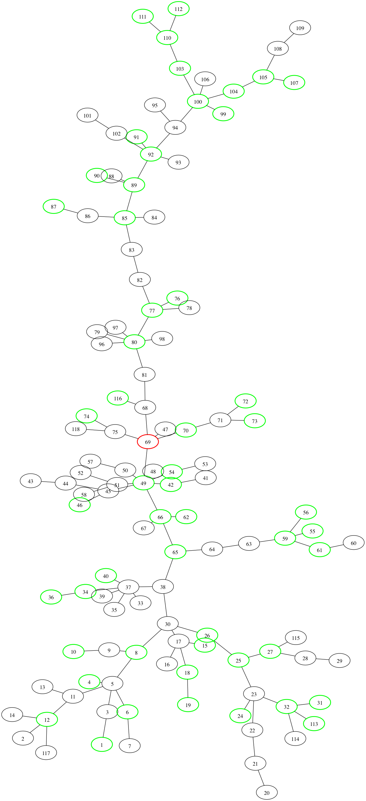

tree-power-flow
===============

Browse the [rendered notebooks](http://nbviewer.ipython.org/github/sharnett/tree-power-flow/tree/master/)

The code is now written in [Julia](http://julialang.org/). It's as easy as Python but much faster. Since it's a pretty new language, the libraries aren't very mature, but this project doesn't really need anything special outside the core language. The notebooks worth looking at are:

* [write up](http://nbviewer.ipython.org/github/sharnett/tree-power-flow/blob/master/precise%20write%20up.ipynb)
* [power flow equations](http://nbviewer.ipython.org/github/sharnett/tree-power-flow/blob/master/power%20flow%20equation%20revisit.ipynb)
* [the code in action](http://nbviewer.ipython.org/github/sharnett/tree-power-flow/blob/master/julia%20profiling.ipynb)
